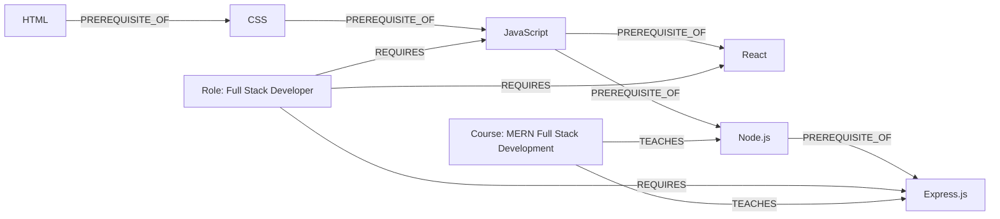

# Live demo: https://vercel.com/farhanakhtar9468-7842s-projects/skill-path-navigator

## Why a graph database?

The core question this app answers is: **"how many hops of learning stand
between what I know and what a role needs?"** That's a path-finding
question, not a row-lookup question.

A relational schema would need a self-referencing `skill_prerequisites`
table (`skill_id`, `prerequisite_id`), and answering "is skill X reachable
from skill Y within N steps" means a recursive CTE that walks that table,
joined against a `role_requirements` table, grouped and aggregated per
role. It works, but it's slow to write, awkward to read, and gets worse
the more hops you allow.

In Cypher, the same question is one readable pattern:

```cypher
MATCH path = (known:Skill)-[:PREREQUISITE_OF*0..3]->(required:Skill)
```

The relationships are traversed natively instead of being reconstructed
through repeated joins, and `shortestPath()` gives an exact route for free.
As the graph grows (more skills, more roles, more courses), the query
doesn't get any more complicated - that's the whole case for a graph
database here: the schema is relationships, not tables, and the queries
that matter are traversals, not lookups.

## Data model

```
(:Skill)-[:PREREQUISITE_OF]->(:Skill)     e.g. JavaScript -> React
(:Role)-[:REQUIRES]->(:Skill)             e.g. Full Stack Developer -> MongoDB
(:Course)-[:TEACHES]->(:Skill)            e.g. "MERN Full Stack Development" -> Node.js
```



Three node labels, three relationship types. Skills chain into each other
via `PREREQUISITE_OF`, roles point at the skills they need, courses point
at the skills they teach. The seed dataset (`backend/src/seed/data.js`)
has 24 skills, 6 roles, and 11 courses - enough to produce real multi-hop
chains without being unwieldy to read.

## The two required traversal queries

**1. Readiness scoring** (`backend/src/routes/readiness.js`) - for every
role and every skill it requires, finds the shortest prerequisite distance
from anything the user already knows (0 = has it exactly, 1-3 = a short
learnable chain away, none = a genuine gap). This is the multi-hop +
aggregate query: it walks variable-length paths _and_ rolls the results up
per role in a single query.

**2. Shortest path** (`backend/src/routes/path.js`) - given one known
skill and one target skill, returns the actual `shortestPath()` chain
between them. Powers the "show route" view in the UI.

## Project structure

```
skill-path-navigator/
├── backend/
│   ├── src/
│   │   ├── server.js          Express app + error handling
│   │   ├── db.js              Neo4j driver connection to CognoDB
│   │   ├── routes/
│   │   │   ├── catalog.js     GET /api/skills, GET /api/roles
│   │   │   ├── readiness.js   POST /api/readiness  (the main query)
│   │   │   └── path.js        POST /api/path       (shortest-path query)
│   │   └── seed/
│   │       ├── data.js        The dataset (edit this to add skills/roles)
│   │       └── seed.js        Loads data.js into CognoDB
│   └── .env.example
└── frontend/
    ├── src/
    │   ├── App.jsx             Two-step flow: pick skills -> see roles
    │   ├── api.js               fetch wrapper
    │   └── components/
    │       ├── SkillSelector.jsx
    │       ├── RoleCard.jsx
    │       └── PathView.jsx     Route/chain visualization
    └── .env.example
```

## Setup

### 1. Create your CognoDB instance

1. Sign up at [console.cognodb.com](https://console.cognodb.com/signup) (no credit card needed for the free tier).
2. Create a free **c0** instance and pick a region.
3. Copy the `bolt+s://...` connection URI and the generated password for user `cognodb` - **the password is shown once**, save it now.

### 2. Backend

```bash
cd backend
cp .env.example .env
# edit .env with your COGNODB_URI and COGNODB_PASSWORD
npm install
npm run seed     # loads the graph data into CognoDB
npm start         # API on http://localhost:4000
```

Visit `http://localhost:4000/api/health` - it should return
`{"status":"ok","database":"connected"}`.

### 3. Frontend

```bash
cd frontend
cp .env.example .env    # defaults to http://localhost:4000, fine for local dev
npm install
npm run dev              # UI on http://localhost:5173
```

## Deployment

- **Backend**: Render (or any Node host). Set `COGNODB_URI`,
  `COGNODB_USER`, `COGNODB_PASSWORD` as environment variables in the
  dashboard - never commit `.env`.
- **Frontend**: Vercel. Set `VITE_API_URL` to your deployed backend URL.
- Keep the CognoDB instance running after deploying, in case it's tested
  against live data.

## Error handling

If CognoDB is unreachable, the API returns `503` with a clear message
instead of hanging, and the frontend surfaces a plain-language warning
banner instead of a blank screen or crash.
